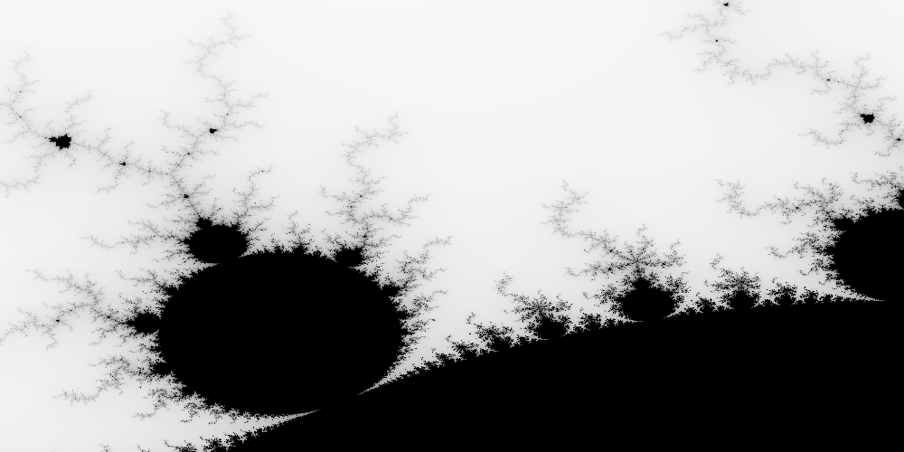

# Example: Mandelbrot Set

> Reference: [Mandelbrot Set](https://en.wikipedia.org/wiki/Mandelbrot_set)

> "The Mandelbrot set is the set of complex numbers \\(c\\) for which the
> function \\( f_c(z) = z^2 + c \\) does not diverge when iterated from \\(z
> = 0\\), i.e., for which the sequence \\( f_c(0), f_c(f_c(0)) \\), etc.,
> remains bounded in absolute value.
>
> The Mandelbrot set is the set of values of \\(c\\) in the complex plane for
> which the orbit of \\(0\\) under iteration of the quadratic map
>
> \\[
> 	z_{n+1} = z^2_n + c
> \\]
>
> remains bounded.""
>
> *Source*: Wikipedia [Mandelbrot Set](https://en.wikipedia.org/wiki/Mandelbrot_set)

We can exploit the property of the Mandelbrot set that a point \\(c\\) belongs
to the Mandelbrot set if and only if it satisfies the condition

\\[
	\forall n \ge 0 \colon \lvert P_c^n(0) \le 2 \rvert
\\]

Should the absolute value of \\( P_c^n(0) \\) become \\( > 2 \\), the
sequence escapes into infinity.

Since multiplication on hardware tends to be faster than division, we can
exploit the fact that for any complex number \\( z = x + iy \\) for some
real numbers \\( x, y \in \mathbb{R} \\), its absolute value is
\\( \lvert x^2 + y^2 \rvert \\). Then the property becomes

\\[
	\begin{align}
		\lvert x^2 + y^2 \rvert &\le 2 \\\\
		\Leftrightarrow x^2 + y^2 &\le 4
	\end{align}
\\]

since \\(x^2, y^2 \ge 0\\) and so
\\( \lvert x^2 + y^2 \rvert \equiv x^2 + y^2 \\).

Additionally, a `loop` can be used to avoid potential stack overflows from
recursive function calls overflowing the call stack (subject to tail call
optimizations).

## Code

```rust
{{#include ../../examples/mandelbrot/src/main.rs}}
```

## The Rust `loop`

Rust provides a convenient way to write an infinite loop via the `loop`
keyword, instead of having to write `while (true)` such as in C.

```rust
fn infinite_loop(mut x: f64) {
	loop {
		x = x * x;
	}
}
```

## The `num` Package

> Reference: [rust-num/num](https://github.com/rust-num/num)

The `num` package contains useful mathematical types, functions and definitions
which could be useful.

### The `Complex` Number

`num` represents a complex number through its `Complex` structure (`struct`)
type, with the real component `re` and the imaginary component `im`.

```rust
struct Complex<T> {
	re: T,
	im: T
}
```

## The `Option<T>` Type

Rust's `Option<T>` `enum` type encodes the possibility of a missing value.
This is to enforce the programming checking for both possibilities (present
or missing) at compile time so we don't miss branches (compared to possible
`null` pointers or values in other languages).

It is defined as

```rust
enum Option<T> {
	None,
	Some(T)
}
```

The `Option<T>` type has one type parameter `T`, or we can say that its
variants (`None` and `Some(T)`) are generic over one type parameter `T` (even
though `None` doesn't actually need type information from `T`).

## Documentation Comments

Rust documentation comments begin with three slashes `///` and are associated
with a `struct`, `enum`, functions, members, constants, etc.

The `rustdoc` utility can produce document from such documentation comments
and documentation tests (known as doctests) are supported.

## Generic Function

To parse a complex number, we define `parse_pair` as a *generic function*
for some type `T` which implements the trait `FromStr`, as defined in the
type capture clause `<T: FromStr>`. This means that we can invoke `parse_pair`
to try to parse a string `s` into a 2-tuple `(T, T)` separated by the
`delimiter` character.

`T` is a *type parameter* to `parse_pair`, and on the call site we are able
to either explicitly specify the type of `T` (like `parse_pair::<i32>`) or
if enough type information exists the Rust compiler may be able to infer
the type of `T` by information from the call site.

In Rust, generic functions like `parse_pair` do not have run-time overheads
for matching types. Instead, they behave like C++ templates in that the Rust
compiler performs compile-time *monomorphisation* to generate specialized
versions of `parse_pair` for every type for which `parse_pair` needs to work
with (e.g. `parse_pair::<i32>` becomes something like `parse_pair_i32` but
properly obfuscated to avoid name conflicts).

## Matching

In Rust, `_` is a valid identifier. This is often useful for ignoring
return values that are not needed, or to serve as a "wildcard" in `match`
expressions:

```rust
match optional_expression {
	Some(val) => {},
	_ => {}
}
```

## Mapping from Pixels to Complex Numbers

The coordinate space of pixels in the generated image needs to correspond to
some point from the complex plane – this requires that we define some mapping

\\[
	\mathtt{pixel\\_to\\_complex} \colon \mathbb{Z}^2 \mapsto \mathbb{C
}\\]

from the *pixel* cartesian coordinate \\( (x, y) \in \mathbb{Z}^2 \\) to
a point in the complex plane \\( \mathbb{C} \\).

## Tuples

Rust supports product types, or `tuple`s. A `tuple` may have zero or more
members that can be different types:

```rust
// 0-tuple: aka the `unit` type
let unit: () = ();
// 1-tuple
let one_tuple: (f64) = (0.5);
// 2-tuple
let two_tuple: (f64, &str) = (0.5, "hello");
```

Tuples support accessing by index (indices start from 0), e.g.

```rust
#fn main() {
	let three_tuple = (1, 'x', 0.9);
	println!("three_tuple.0 = {}", three_tuple.0);
	println!("three_tuple.1 = {}", three_tuple.1);
	println!("three_tuple.2 = {}", three_tuple.2);
#}
```

## Type Casting / Coersion

The type cast / coersion expression `expression as T` tries to cast
`expression` of type `U` into some type `T`.

```rust
#fn main() {
	let x: u64 = 123;
	let y: f64 = x as f64;
	println!("y = {}", y);
#}
```

Rust does not convert between numeric types implicitly to prevent issues such
as floating-point errors and precision losses, and instead requires such
casts to be explicitly written out, compared to C/C++.

## Working with Images

> Reference: [image-rs/image](https://github.com/image-rs/image)

Rust has the `image` create for working with images of various formats.

## The `?` Operator

The `?` operator is syntactical sugar for

```rust
match expression_evaluating_to_result {
	Ok(f) => f,
	Err(e) => { return Err(e); }
}
```

given that the containing function returns `Result<T, E>` itself.

For example,

```rust
let output = File::create(filename)?;
```

is equivalent in semantics to

```rust
let output = match File::create(filename) {
	Ok(f) => f,
	Err(e) => { return Err(e); }
};
```

## Vector Initialization Macro

The `vec![v; n]` macro can be useful to create a `Vec` of size `n` with all
elements initialized to `v`.

```rust
#fn main() {
	let vector = vec![5; 3];
	println!("vector = {:?}", &vector);
#}
```

## Getting Concurrent

We can divide the work of computing the image into sections, e.g. into
horizontal stripes, so we can use *divide and conquer* to delegate work
to different processors.

> Reference: [crossbeam-rs/crossbeam](https://github.com/crossbeam-rs/crossbeam)

Rust has the `crossbeam` crate which has support for multiple concurrency
tools, including *scoped thread*.

> Reference: [seanmonstar/num_cpus](https://github.com/seanmonstar/num_cpus)

We spawn `n` threads where `n` is the number of logical cores on the system
to do the work. Note: this requires careful profiling as the overhead of
thread context-switching by the OS might overweigh the benefits brought by
multiple threads.

## Example Output

```bash
cargo run mandelbrot.png 1000x500 -1.20,0.35 -1,0.20
```


